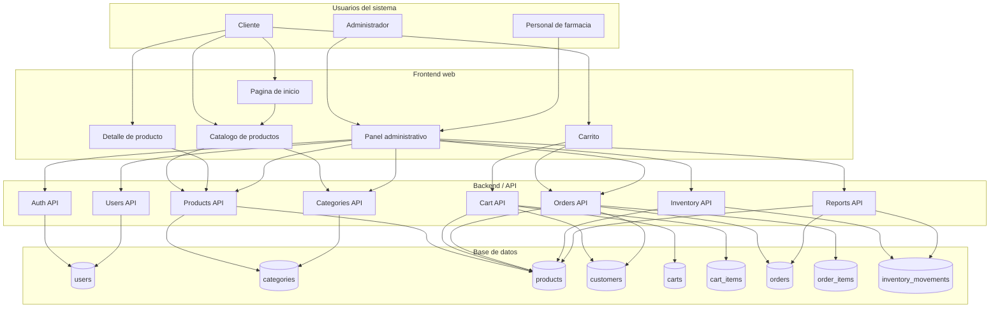

# Diagrama de arquitectura del sistema

## Sistema web FarmaGest Vital

## 1. Objetivo del diagrama

Representar la estructura general de FarmaGest Vital, mostrando la relacion entre usuarios, frontend, backend, base de datos y modulos principales de la primera version.

La arquitectura excluye proveedores, compras a proveedores, detalle de compras, abastecimiento y gestion contable, porque esos procesos no son necesarios para demostrar el flujo principal del proyecto.

## 2. Diagrama de arquitectura

## 3. Capas del sistema

| Capa | Descripcion | Responsabilidad |
| --- | --- | --- |
| Usuarios | Personas que interactuan con el sistema. | Consultar productos, generar pedidos y administrar informacion basica de la farmacia. |
| Frontend web | Interfaz visible del sistema. | Mostrar pantallas, capturar acciones y consumir la API. |
| Backend / API | Servidor encargado de procesar la logica del sistema. | Validar datos, aplicar reglas de negocio y comunicarse con la base de datos. |
| Base de datos | Almacenamiento central de informacion. | Guardar productos, categorias, clientes, carritos, pedidos, inventario y usuarios. |

## 4. Componentes principales

| Componente | Funcion |
| --- | --- |
| Pagina de inicio | Presenta la marca, categorias y acceso al catalogo. |
| Catalogo de productos | Muestra productos disponibles y permite filtrarlos. |
| Detalle de producto | Presenta informacion ampliada de cada producto. |
| Carrito | Permite administrar productos seleccionados y generar pedidos. |
| Panel administrativo | Permite gestionar productos, categorias, inventario, pedidos, clientes, usuarios y reportes. |
| Auth API | Valida acceso al panel administrativo. |
| Products API | Permite consultar, crear, actualizar o desactivar productos. |
| Categories API | Administra categorias de productos. |
| Cart API | Administra productos seleccionados antes de crear el pedido. |
| Orders API | Registra pedidos generados por clientes y permite gestionarlos. |
| Inventory API | Controla stock, ajustes y alertas. |
| Users API | Administra usuarios internos. |
| Reports API | Consulta informacion resumida sobre productos, pedidos e inventario. |

## 5. Flujo de informacion

| Paso | Descripcion |
| --- | --- |
| 1 | El usuario ingresa al sistema desde el navegador. |
| 2 | El frontend muestra las pantallas correspondientes segun el tipo de usuario. |
| 3 | Cuando el usuario realiza una accion, el frontend envia una solicitud al backend. |
| 4 | El backend valida la solicitud y aplica reglas de negocio. |
| 5 | El backend consulta o actualiza la informacion en la base de datos. |
| 6 | La base de datos devuelve la informacion solicitada. |
| 7 | El backend responde al frontend. |
| 8 | El frontend muestra el resultado al usuario. |

## 6. Responsabilidades por usuario

| Usuario | Acceso principal | Funciones |
| --- | --- | --- |
| Cliente | Area publica | Consultar catalogo, ver detalles, agregar productos al carrito y generar pedidos. |
| Administrador | Panel administrativo | Gestionar productos, categorias, inventario, pedidos, clientes, usuarios y reportes. |
| Personal de farmacia | Panel administrativo | Consultar inventario, atender pedidos y registrar ajustes operativos. |

## 7. Consideraciones tecnicas

| Consideracion | Descripcion |
| --- | --- |
| Separacion de responsabilidades | El frontend muestra interfaces y el backend concentra la logica del negocio. |
| Persistencia de datos | La informacion debe guardarse en PostgreSQL para no depender del navegador. |
| Seguridad | El panel administrativo debe estar protegido por autenticacion. |
| Mantenibilidad | La separacion por modulos facilita corregir errores y agregar funciones. |
| Alcance controlado | Se priorizan los modulos necesarios para completar una version funcional y presentable. |

## 8. Resultado esperado

El sistema funciona como una aplicacion web organizada por capas. El cliente interactua con el catalogo y el carrito, mientras que el administrador y el personal de farmacia gestionan productos, pedidos e inventario desde el panel administrativo.
