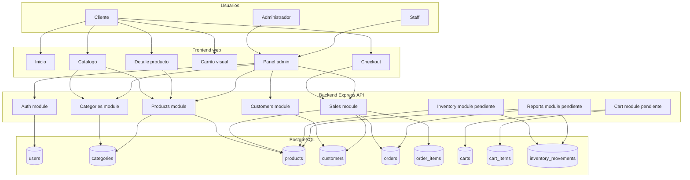

# Diagrama De Arquitectura Del Sistema

## FarmaGest Vital

## 1. Objetivo

Representar la arquitectura actual de FarmaGest Vital, separando usuarios, frontend, API backend y base de datos PostgreSQL.

## 2. Diagrama

## 3. Capas

| Capa | Responsabilidad |
| --- | --- |
| Cliente web | Navega catalogo, carrito y checkout sin cuenta. |
| Panel admin | Administra productos, categorias, clientes y ventas. |
| API Express | Valida datos, aplica reglas de negocio y expone rutas. |
| PostgreSQL | Persiste usuarios, productos, clientes, ventas e inventario. |

## 4. Modulos Backend

| Modulo | Estado | Responsabilidad |
| --- | --- | --- |
| `auth` | Implementado | Autenticacion, registro, login y JWT. |
| `categories` | Implementado | CRUD de categorias. |
| `products` | Implementado | CRUD de productos, stock y vencimientos. |
| `customers` | Implementado | Gestion administrativa de clientes. |
| `sales` | Implementado | Checkout publico, venta interna, detalle, stock e historial. |
| `cart` | Pendiente | Persistencia de carrito. |
| `inventory` | Pendiente | Movimientos y ajustes de inventario. |
| `reports` | Pendiente | Reportes y metricas. |

## 5. Flujo Publico

| Paso | Descripcion |
| --- | --- |
| 1 | El cliente consulta catalogo y detalle. |
| 2 | Agrega productos al carrito visual. |
| 3 | En checkout ingresa nombre, telefono, correo y direccion opcional. |
| 4 | El frontend envia la solicitud a `/api/sales/checkout`. |
| 5 | El backend crea o reutiliza el cliente por email. |
| 6 | El backend crea venta, detalle y descuenta stock. |
| 7 | El cliente recibe resumen de compra. |

## 6. Flujo Administrativo

| Paso | Descripcion |
| --- | --- |
| 1 | Admin o staff inicia sesion y recibe JWT. |
| 2 | El frontend consume rutas protegidas. |
| 3 | El usuario gestiona categorias, productos, clientes y ventas. |
| 4 | El sistema valida roles `admin` y `staff`. |
| 5 | Las operaciones se guardan en PostgreSQL. |

## 7. Consideraciones Tecnicas

| Consideracion | Descripcion |
| --- | --- |
| Seguridad | Rutas administrativas protegidas por JWT. |
| Checkout publico | No requiere token para no obligar al cliente a registrarse. |
| Transacciones | La venta se crea en transaccion para evitar registros parciales. |
| Stock | El stock se bloquea y descuenta en la venta. |
| Vencimiento | Productos vencidos no pueden venderse. |
| Modularidad | Cada modulo separa rutas, controllers, services y repositories. |

## 8. Resultado Esperado

La arquitectura permite operar el flujo principal de farmacia: administrar catalogo, vender productos, registrar clientes y consultar ventas. Los modulos pendientes pueden agregarse sin romper la estructura actual.
