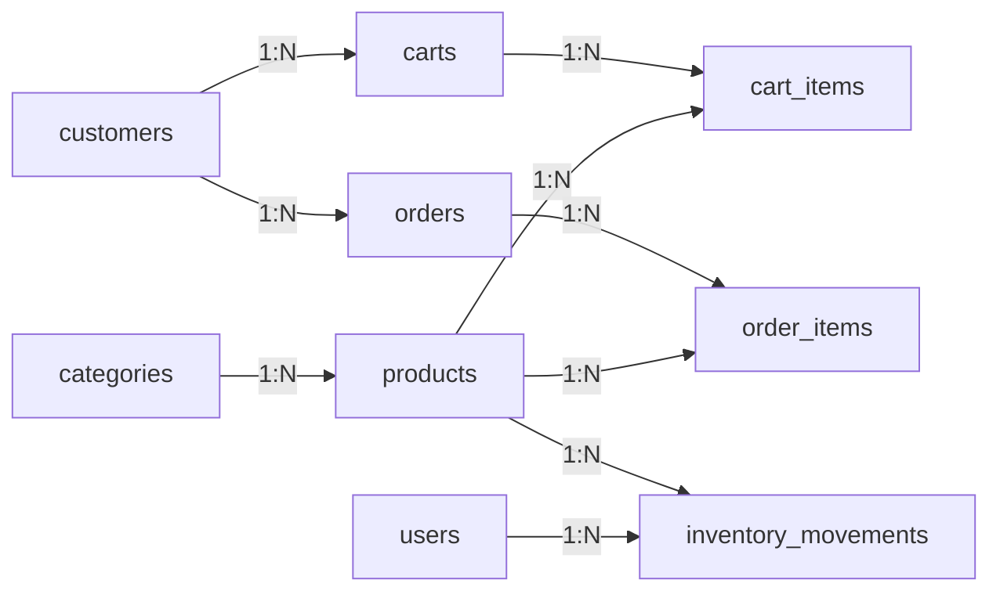
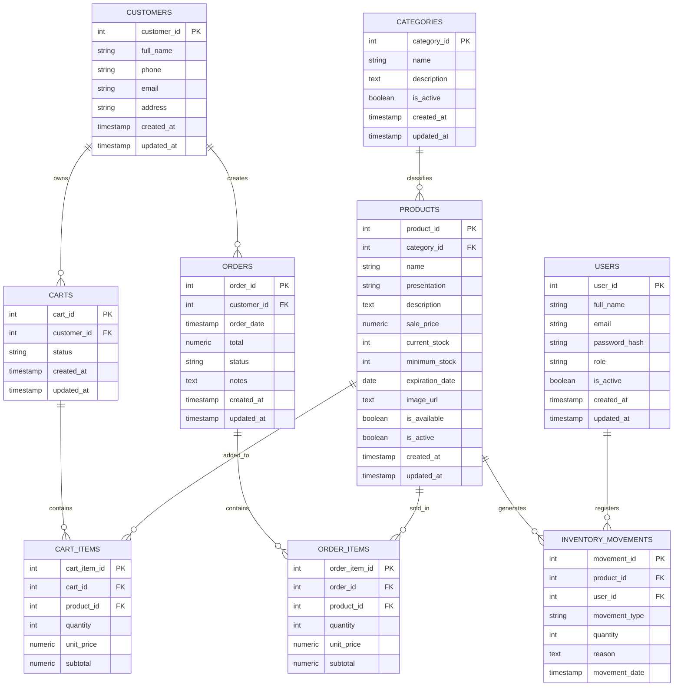

# Diagrama Entidad-Relacion De Base De Datos

## FarmaGest Vital

## 1. Objetivo

Documentar el modelo relacional usado por FarmaGest Vital en PostgreSQL. Esta version refleja el script actual ubicado en `backends/src/db/db.sql`.

El backend usa el modulo `sales` para gestionar ventas, pero la base de datos conserva las tablas `orders` y `order_items` para almacenar la cabecera y el detalle de cada venta.

## 2. Alcance

| Incluido | Excluido |
| --- | --- |
| Usuarios internos | Proveedores |
| Categorias | Compras a proveedores |
| Productos | Detalle de compras |
| Clientes | Abastecimiento |
| Carritos | Reportes de compras |
| Ventas en `orders` y `order_items` | Contabilidad |
| Movimientos de inventario | Costos avanzados |

## 3. Modulos Y Tablas

| Modulo backend | Tablas principales | Estado |
| --- | --- | --- |
| `auth` | `users` | Implementado |
| `categories` | `categories` | Implementado |
| `products` | `products`, `categories` | Implementado |
| `customers` | `customers` | Implementado |
| `sales` | `customers`, `orders`, `order_items`, `products` | Implementado |
| `cart` | `carts`, `cart_items` | Pendiente |
| `inventory` | `inventory_movements`, `products`, `users` | Pendiente |
| `reports` | `orders`, `products`, `inventory_movements` | Pendiente |

## 4. Vista General

## 5. Diagrama Detallado

## 6. Descripcion De Entidades

| Tabla | Descripcion |
| --- | --- |
| `users` | Usuarios internos para login administrativo. |
| `categories` | Clasificacion de productos. |
| `products` | Productos de la farmacia con precio, stock y vencimiento. |
| `customers` | Datos basicos de clientes que compran. |
| `carts` | Carritos persistentes pendientes de implementar en backend. |
| `cart_items` | Productos asociados a un carrito. |
| `orders` | Cabecera de venta. |
| `order_items` | Detalle de productos vendidos. |
| `inventory_movements` | Movimientos de stock pendientes de implementar. |

## 7. Reglas De Integridad

| Regla | Descripcion |
| --- | --- |
| Categoria requerida | Todo producto debe pertenecer a una categoria. |
| Cliente requerido | Toda venta debe estar asociada a un cliente. |
| Detalle requerido | Una venta valida debe tener al menos un item. |
| Stock no negativo | `current_stock` no debe ser menor que cero. |
| Cantidad positiva | `quantity` debe ser mayor que cero en carrito, ventas e inventario. |
| Precio no negativo | `sale_price`, `unit_price`, `subtotal` y `total` no deben ser negativos. |
| Email unico | `users.email` y `customers.email` son unicos. |

## 8. Estados

### `user_role`

| Valor | Uso |
| --- | --- |
| `admin` | Administrador del sistema. |
| `staff` | Personal operativo de farmacia. |

### `order_status`

| Valor | Uso |
| --- | --- |
| `pending` | Venta o pedido recibido. |
| `processing` | En revision. |
| `completed` | Venta completada. |
| `cancelled` | Venta cancelada. |

### `cart_status`

| Valor | Uso |
| --- | --- |
| `active` | Carrito en uso. |
| `converted` | Carrito convertido en venta. |
| `abandoned` | Carrito abandonado. |

### `inventory_movement_type`

| Valor | Uso |
| --- | --- |
| `in` | Entrada de stock. |
| `out` | Salida de stock. |
| `adjustment` | Ajuste manual. |

## 9. Orden De Creacion

1. `users`
2. `categories`
3. `products`
4. `customers`
5. `carts`
6. `cart_items`
7. `orders`
8. `order_items`
9. `inventory_movements`

## 10. Observaciones

- Los IDs actuales usan `INT GENERATED ALWAYS AS IDENTITY`.
- Las ventas se trabajan desde el modulo `sales`, aunque la tabla se llame `orders`.
- El checkout publico crea o reutiliza clientes por email.
- La venta descuenta stock dentro de una transaccion.
- Inventario y reportes tienen base de datos preparada, pero sus modulos aun estan pendientes.
