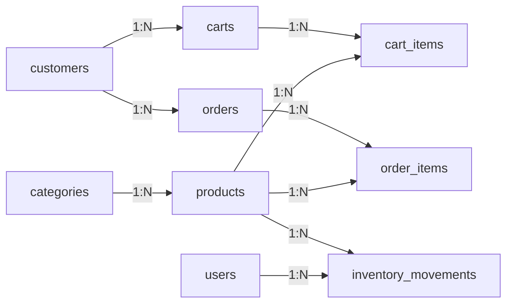
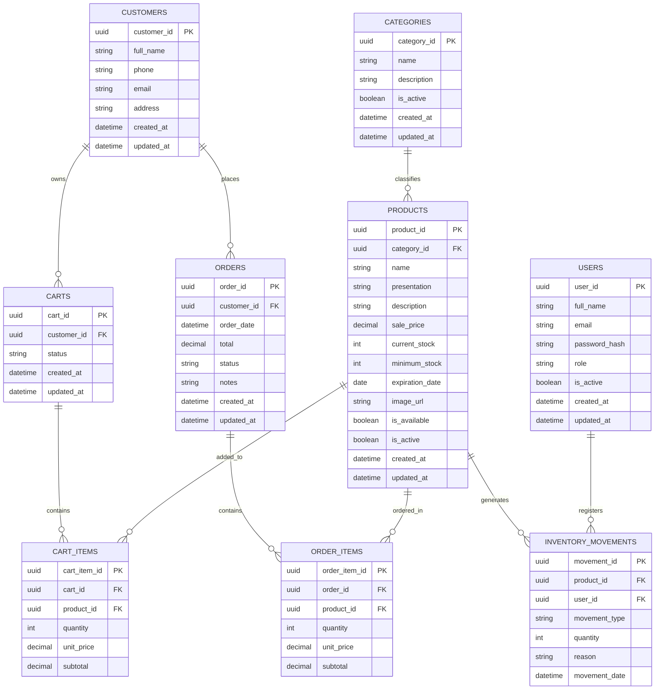

# Diagrama entidad-relacion de base de datos

## Sistema web FarmaGest Vital

## 1. Objetivo del diagrama

Definir la estructura de datos necesaria para la primera version de FarmaGest Vital, tomando como base la propuesta del proyecto y los modulos actuales del backend.

Este modelo esta pensado para implementarse posteriormente en PostgreSQL mediante PgAdmin4. No se incluye `schema.sql`, porque la creacion fisica de las tablas se realizara directamente desde PgAdmin4.

Los nombres de tablas y campos se plantean en ingles para mantener consistencia tecnica con el backend.

## 2. Alcance de base de datos

| Incluido | Excluido |
| --- | --- |
| Usuarios administrativos | Proveedores |
| Categorias | Compras a proveedores |
| Productos | Detalle de compras |
| Clientes | Abastecimiento |
| Carritos | Reportes de compras |
| Pedidos | Gestion contable |
| Movimientos de inventario | Costos avanzados |

## 3. Modulos del backend considerados

| Backend module | Main tables | Purpose |
| --- | --- | --- |
| `auth` | `users` | Login, roles and access control. |
| `users` | `users` | Administrative user management. |
| `products` | `categories`, `products` | Product catalog and product information. |
| `cart` | `carts`, `cart_items`, `products` | Temporary shopping cart before creating an order. |
| `orders` | `customers`, `orders`, `order_items` | Customer orders from the ecommerce frontend. |
| `inventory` | `products`, `inventory_movements` | Stock control, exits, adjustments and alerts. |
| `reports` | `products`, `orders`, `inventory_movements` | Basic summaries and operational reports. |

## 4. Diagrama entidad-relacion

### 4.1 Vista general compatible

### 4.2 Vista entidad-relacion detallada

## 5. Descripcion de entidades

| Table | Description |
| --- | --- |
| `users` | Guarda usuarios internos que pueden acceder al panel administrativo. |
| `categories` | Clasifica los productos del catalogo. |
| `products` | Guarda la informacion principal de cada producto de la farmacia. |
| `customers` | Guarda datos basicos de clientes que generan pedidos. |
| `carts` | Representa el carrito activo o finalizado de un cliente. |
| `cart_items` | Guarda los productos agregados temporalmente al carrito. |
| `orders` | Registra pedidos creados desde el catalogo en linea. |
| `order_items` | Guarda productos, cantidades y subtotales de cada pedido. |
| `inventory_movements` | Registra salidas, entradas manuales y ajustes de inventario. |

## 6. Relaciones principales

| Relationship | Type | Explanation |
| --- | --- | --- |
| `categories` - `products` | One to many | Una categoria puede tener muchos productos. |
| `customers` - `carts` | One to many | Un cliente puede tener varios carritos historicos. |
| `carts` - `cart_items` | One to many | Un carrito puede contener varios productos. |
| `products` - `cart_items` | One to many | Un producto puede aparecer en varios carritos. |
| `customers` - `orders` | One to many | Un cliente puede realizar varios pedidos. |
| `orders` - `order_items` | One to many | Un pedido puede contener varios productos. |
| `products` - `order_items` | One to many | Un producto puede aparecer en muchos pedidos. |
| `products` - `inventory_movements` | One to many | Un producto puede tener multiples movimientos de inventario. |
| `users` - `inventory_movements` | One to many | Un usuario puede registrar varios movimientos de inventario. |

## 7. Campos clave por modulo

### 7.1 Products and inventory

| Field | Use |
| --- | --- |
| `sale_price` | Precio mostrado al cliente y usado en pedidos. |
| `current_stock` | Cantidad disponible del producto. |
| `minimum_stock` | Valor usado para alertas de bajo inventario. |
| `expiration_date` | Fecha usada para alertas de vencimiento. |
| `is_available` | Define si el producto puede mostrarse en el catalogo. |
| `is_active` | Permite desactivar productos sin eliminarlos. |

### 7.2 Cart and orders

| Field | Use |
| --- | --- |
| `status` | Controla el estado del carrito o pedido. |
| `total` | Guarda el valor total del pedido. |
| `notes` | Permite registrar observaciones. |
| `unit_price` | Conserva el precio del producto al momento de crear el pedido. |
| `subtotal` | Resultado de `quantity * unit_price`. |

### 7.3 Inventory movements

| Field | Use |
| --- | --- |
| `movement_type` | Indica si el movimiento es entrada manual, salida o ajuste. |
| `quantity` | Cantidad afectada por el movimiento. |
| `reason` | Motivo del ajuste o salida. |
| `movement_date` | Fecha en que se registra el movimiento. |

## 8. Reglas de integridad

| Rule | Description |
| --- | --- |
| Product category required | Todo producto debe pertenecer a una categoria existente. |
| Customer order required | Todo pedido debe estar asociado a un cliente. |
| Order items required | No debe existir un pedido confirmado sin productos asociados. |
| Non-negative stock | El inventario de un producto no debe quedar por debajo de cero. |
| Inventory traceability | Toda salida, entrada manual o ajuste debe quedar registrado. |
| Responsible user | Los movimientos administrativos deben registrar el usuario responsable. |

## 9. Estados recomendados

### 9.1 `orders.status`

| Status | Description |
| --- | --- |
| `pending` | Pedido recibido, aun sin atender. |
| `processing` | Pedido revisado por la farmacia. |
| `completed` | Pedido atendido correctamente. En este estado puede descontarse inventario. |
| `cancelled` | Pedido anulado. |

### 9.2 `carts.status`

| Status | Description |
| --- | --- |
| `active` | Carrito disponible para seguir agregando productos. |
| `converted` | Carrito convertido en pedido. |
| `abandoned` | Carrito abandonado o no finalizado. |

### 9.3 `inventory_movements.movement_type`

| Type | Description |
| --- | --- |
| `in` | Aumenta stock por entrada manual o ajuste positivo. |
| `out` | Disminuye stock por pedido completado o ajuste negativo. |
| `adjustment` | Corrige el inventario por conteo fisico u otra razon administrativa. |

## 10. Orden recomendado para crear las tablas en PgAdmin4

1. `users`
2. `categories`
3. `customers`
4. `products`
5. `carts`
6. `cart_items`
7. `orders`
8. `order_items`
9. `inventory_movements`

## 11. Observaciones para implementacion en PgAdmin4

- Usar `uuid` como tipo de dato para los campos terminados en `_id`.
- Activar la extension `pgcrypto` en PostgreSQL con `CREATE EXTENSION IF NOT EXISTS pgcrypto;`.
- Usar `DEFAULT gen_random_uuid()` para que PostgreSQL genere automaticamente los identificadores.
- Usar claves foraneas para mantener relaciones entre tablas.
- Usar `numeric` o `decimal` para precios, totales y subtotales.
- Usar `boolean` para campos como `is_active` e `is_available`.
- Usar `timestamp` para fechas con hora como `created_at`, `updated_at`, `order_date` y `movement_date`.
- Evitar eliminar registros importantes; es mejor desactivarlos para conservar historial.
- Mantener los nombres en ingles en la base de datos y en el backend.

## 12. Resultado esperado

Este modelo permite soportar los modulos necesarios de la primera version: autenticacion, usuarios, catalogo, carrito, pedidos, inventario y reportes basicos. La estructura queda preparada para implementarse manualmente en PostgreSQL desde PgAdmin4 y conectarse despues con el backend.
