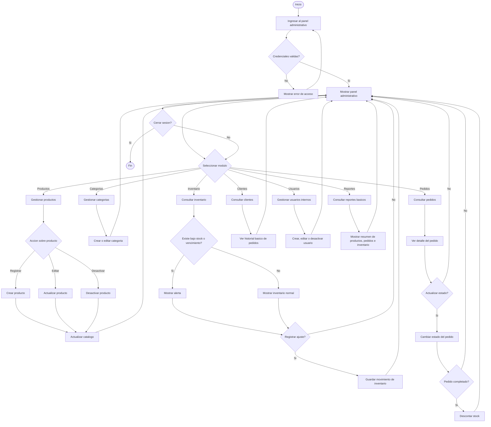

# Diagrama de flujo del administrador

## Sistema web FarmaGest Vital

## 1. Objetivo del diagrama

Representar el recorrido principal que realiza el administrador o personal de farmacia dentro del sistema. El flujo se enfoca en los modulos necesarios para esta version: productos, categorias, inventario, pedidos, clientes, usuarios y reportes basicos.

Los modulos de proveedores, compras a proveedores, detalle de compras y abastecimiento no forman parte de esta version.

## 2. Diagrama de flujo

## 3. Descripcion del flujo

| Paso | Accion | Resultado |
| --- | --- | --- |
| 1 | El administrador ingresa al panel administrativo. | El sistema solicita o valida las credenciales. |
| 2 | El sistema valida el acceso. | Si las credenciales son correctas, muestra el panel administrativo. |
| 3 | El administrador selecciona un modulo. | El sistema abre la seccion correspondiente. |
| 4 | En productos, registra, edita o desactiva productos. | El catalogo queda actualizado. |
| 5 | En categorias, organiza los productos. | Las categorias quedan disponibles para el catalogo. |
| 6 | En inventario, consulta existencias y alertas. | El sistema muestra stock normal, bajo stock o vencimientos. |
| 7 | En inventario, puede registrar ajustes manuales. | El movimiento queda guardado para trazabilidad. |
| 8 | En pedidos, revisa solicitudes de clientes. | Puede consultar el detalle y cambiar el estado. |
| 9 | Al completar un pedido, el sistema descuenta stock. | El inventario queda actualizado. |
| 10 | En clientes, consulta informacion asociada a pedidos. | El administrador puede dar seguimiento basico. |
| 11 | En usuarios, administra accesos internos. | El sistema mantiene control de acceso al panel. |
| 12 | En reportes, consulta resumenes. | El sistema muestra informacion basica de productos, pedidos e inventario. |

## 4. Validaciones principales

| Validacion | Descripcion |
| --- | --- |
| Acceso administrativo | Solo usuarios autorizados pueden ingresar al panel. |
| Datos de producto | No se deben registrar productos incompletos. |
| Categoria requerida | Todo producto debe pertenecer a una categoria. |
| Stock minimo | El sistema debe identificar productos con bajo inventario. |
| Fecha de vencimiento | El sistema debe detectar productos proximos a vencer. |
| Estado de pedido | Los pedidos deben tener estados claros: pendiente, en proceso, completado o cancelado. |
| Stock en pedido | No se debe completar un pedido si no hay stock suficiente. |
| Movimiento de inventario | Todo ajuste debe registrar cantidad, motivo y usuario responsable. |

## 5. Modulos administrativos incluidos

| Modulo | Funcion principal |
| --- | --- |
| Productos | Registrar, editar, consultar y desactivar productos. |
| Categorias | Organizar productos para catalogo y filtros. |
| Inventario | Controlar stock, bajo inventario, vencimientos y ajustes. |
| Pedidos | Revisar y actualizar pedidos generados por clientes. |
| Clientes | Consultar informacion basica asociada a pedidos. |
| Usuarios | Administrar usuarios internos del sistema. |
| Reportes | Consultar resumenes basicos del negocio. |

## 6. Resultado esperado

El administrador puede controlar las operaciones principales de esta version desde un panel interno, sin agregar complejidad innecesaria. El sistema se concentra en productos, inventario, pedidos y seguimiento basico, que son los procesos necesarios para demostrar el funcionamiento de FarmaGest Vital.
