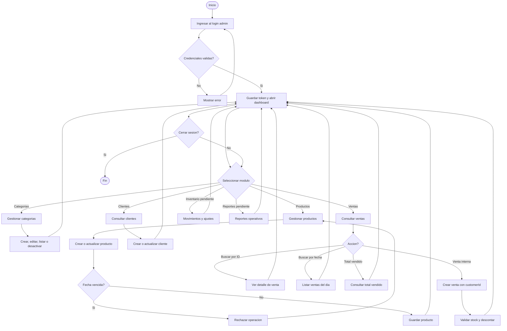

# Diagrama De Flujo Del Administrador

## FarmaGest Vital

## 1. Objetivo

Representar el flujo administrativo actual: autenticacion, gestion de categorias, productos, clientes y ventas. Inventario avanzado y reportes quedan como siguientes modulos.

## 2. Diagrama

## 3. Flujo Administrativo

| Paso | Accion | Resultado |
| --- | --- | --- |
| 1 | Admin o staff inicia sesion. | Recibe token JWT. |
| 2 | Entra al dashboard. | Consulta resumen y navegacion. |
| 3 | Gestiona categorias. | Organiza catalogo. |
| 4 | Gestiona productos. | Crea, edita, desactiva y valida vencimientos. |
| 5 | Gestiona clientes. | Consulta o actualiza clientes. |
| 6 | Gestiona ventas. | Consulta historial, detalle, fecha y total vendido. |
| 7 | Crea venta interna. | Usa cliente existente o datos de cliente y descuenta stock. |

## 4. Validaciones

| Validacion | Descripcion |
| --- | --- |
| Token requerido | Las rutas administrativas requieren JWT. |
| Roles validos | Solo `admin` y `staff` acceden a clientes y ventas. |
| Producto valido | Producto debe tener categoria, precio, stock y fecha valida. |
| Producto no vencido | No se vende producto vencido. |
| Stock suficiente | La venta interna no puede dejar stock negativo. |
| Cliente valido | La venta interna debe asociarse a un cliente. |

## 5. Modulos Administrativos

| Modulo | Estado |
| --- | --- |
| Auth | Implementado |
| Categorias | Implementado |
| Productos | Implementado |
| Clientes | Implementado |
| Ventas | Implementado |
| Inventario | Pendiente |
| Reportes | Pendiente |

## 6. Resultado Esperado

El personal interno puede administrar el flujo principal de la farmacia: productos, categorias, clientes y ventas. Los modulos de inventario y reportes se agregaran despues sobre la misma base.
