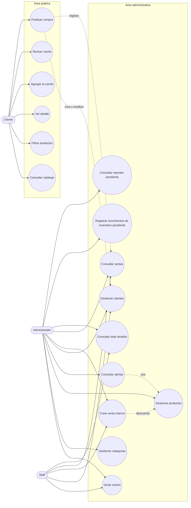

# Diagrama De Casos De Uso

## FarmaGest Vital

## 1. Objetivo

Representar las funciones principales disponibles para cliente, administrador y personal de farmacia en el alcance actual del proyecto.

## 2. Actores

| Actor | Descripcion |
| --- | --- |
| Cliente | Consulta productos y finaliza compra sin crear cuenta. |
| Administrador | Gestiona catalogo, clientes, ventas y configuracion operativa. |
| Staff | Atiende ventas y consulta informacion operativa. |

## 3. Diagrama

## 4. Casos De Uso Del Cliente

| Codigo | Caso | Estado | Descripcion |
| --- | --- | --- | --- |
| CU01 | Consultar catalogo | Parcial | Visualiza productos disponibles. |
| CU02 | Filtrar productos | Parcial | Filtra por categoria o busqueda. |
| CU03 | Ver detalle | Parcial | Consulta informacion del producto. |
| CU04 | Agregar al carrito | Frontend | Agrega productos al carrito visual. |
| CU05 | Revisar carrito | Frontend | Modifica cantidades y revisa total. |
| CU06 | Finalizar compra | Backend implementado | Envia datos a `/api/sales/checkout`. |

## 5. Casos De Uso Administrativos

| Codigo | Caso | Estado | Descripcion |
| --- | --- | --- | --- |
| CU07 | Iniciar sesion | Implementado | Login con JWT. |
| CU08 | Gestionar categorias | Implementado | Crear, listar, buscar, actualizar y desactivar. |
| CU09 | Gestionar productos | Implementado | CRUD, stock, disponibilidad y vencimientos. |
| CU10 | Consultar alertas | Parcial | Bajo stock y vencimientos visibles en frontend. |
| CU11 | Gestionar clientes | Implementado | Crear, listar, buscar y actualizar clientes. |
| CU12 | Crear venta interna | Implementado | Ruta protegida `/api/sales/created-sale`. |
| CU13 | Consultar ventas | Implementado | Historial, ID, fecha y rango. |
| CU14 | Consultar total vendido | Implementado | Total general o por rango. |
| CU15 | Registrar inventario | Pendiente | Entradas, salidas y ajustes. |
| CU16 | Consultar reportes | Pendiente | Reportes operativos. |

## 6. Reglas Asociadas

| Regla | Caso relacionado |
| --- | --- |
| Cliente publico sin cuenta | CU06 |
| Validar stock antes de vender | CU06, CU12 |
| Impedir venta de producto vencido | CU06, CU12 |
| Proteger rutas administrativas | CU07 al CU16 |
| Reutilizar cliente por email | CU06 |

## 7. Resultado Esperado

El diagrama diferencia claramente el flujo publico de compra y el flujo interno administrativo. Tambien separa lo implementado de lo pendiente para evitar confusion durante el desarrollo.
