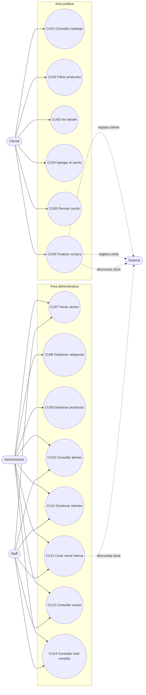

# Casos De Uso Del Proyecto

## FarmaGest Vital

## 1. Objetivo Del Documento

Documentar los casos de uso principales del aplicativo FarmaGest Vital, identificando actores, objetivos, flujos, reglas y resultados esperados. Este documento servira como base para reglas de negocio, diagramas de flujo, diseno de interfaces y validacion funcional del sistema.

El alcance se mantiene alineado con el proyecto actual: catalogo publico, carrito, checkout, autenticacion administrativa, gestion de categorias, productos, clientes y ventas. No se incluyen proveedores, compras a proveedores, contabilidad ni pagos en linea, porque no forman parte de la version actual del sistema.

## 2. Actores Identificados

| Actor | Descripcion | Tipo |
| --- | --- | --- |
| Cliente | Usuario externo que consulta productos, agrega productos al carrito y finaliza una compra sin crear cuenta. | Externo |
| Administrador | Usuario interno con permisos para administrar catalogo, productos, categorias, clientes, ventas y consultas operativas. | Interno |
| Staff | Personal de farmacia que consulta informacion operativa, clientes y ventas. | Interno |
| Sistema | Componente que valida reglas, registra ventas, descuenta stock y guarda informacion. | Automatico |

## 3. Casos De Uso Por Actor

| Actor | Casos de uso asociados |
| --- | --- |
| Cliente | CU01 Consultar catalogo, CU02 Filtrar productos por categoria, CU03 Ver detalle de producto, CU04 Agregar producto al carrito, CU05 Revisar carrito, CU06 Finalizar compra |
| Administrador | CU07 Iniciar sesion, CU08 Gestionar categorias, CU09 Gestionar productos, CU10 Consultar alertas de productos, CU11 Gestionar clientes, CU12 Crear venta interna, CU13 Consultar ventas, CU14 Consultar total vendido |
| Staff | CU07 Iniciar sesion, CU10 Consultar alertas de productos, CU11 Gestionar clientes, CU12 Crear venta interna, CU13 Consultar ventas, CU14 Consultar total vendido |
| Sistema | CU06 Finalizar compra, CU12 Crear venta interna |

## 4. Diagrama General De Casos De Uso



## 5. Resumen De Casos De Uso

| Codigo | Nombre | Actor principal | Estado actual | Prioridad |
| --- | --- | --- | --- | --- |
| CU01 | Consultar catalogo | Cliente | Implementado | Alta |
| CU02 | Filtrar productos por categoria | Cliente | Implementado | Alta |
| CU03 | Ver detalle de producto | Cliente | Implementado | Alta |
| CU04 | Agregar producto al carrito | Cliente | Implementado en frontend | Alta |
| CU05 | Revisar carrito | Cliente | Implementado en frontend | Alta |
| CU06 | Finalizar compra | Cliente | Implementado frontend/backend | Alta |
| CU07 | Iniciar sesion | Administrador, Staff | Implementado | Alta |
| CU08 | Gestionar categorias | Administrador | Implementado | Alta |
| CU09 | Gestionar productos | Administrador | Implementado | Alta |
| CU10 | Consultar alertas de productos | Administrador, Staff | Parcial | Media |
| CU11 | Gestionar clientes | Administrador, Staff | Backend implementado | Media |
| CU12 | Crear venta interna | Administrador, Staff | Backend implementado | Media |
| CU13 | Consultar ventas | Administrador, Staff | Backend implementado | Media |
| CU14 | Consultar total vendido | Administrador, Staff | Backend implementado | Media |

## 6. Desarrollo De Casos De Uso

## CU01 - Consultar Catalogo

| Campo | Descripcion |
| --- | --- |
| Identificador | CU01 |
| Nombre | Consultar catalogo |
| Actor principal | Cliente |
| Objetivo | Permitir que el cliente visualice los productos disponibles de la farmacia. |
| Descripcion | El cliente ingresa al sitio web y observa una lista de productos disponibles con nombre, categoria, descripcion, precio y accion para ver detalle o agregar al carrito. |
| Precondiciones | El sitio debe estar disponible. Deben existir productos activos y disponibles registrados en el sistema. |
| Resultado esperado | El cliente visualiza el catalogo publico con informacion actualizada desde el backend. |

**Flujo principal**

| Paso | Accion |
| --- | --- |
| 1 | El cliente ingresa a la pagina principal. |
| 2 | El sistema consulta los productos disponibles. |
| 3 | El sistema muestra los productos en tarjetas. |
| 4 | El cliente revisa la informacion basica de los productos. |

**Flujos alternativos o excepciones**

| Codigo | Situacion | Respuesta del sistema |
| --- | --- | --- |
| A1 | No existen productos disponibles. | El sistema muestra un mensaje indicando que no hay productos disponibles. |
| A2 | Falla la conexion con el backend. | El sistema muestra un mensaje de error de carga del catalogo. |

## CU02 - Filtrar Productos Por Categoria

| Campo | Descripcion |
| --- | --- |
| Identificador | CU02 |
| Nombre | Filtrar productos por categoria |
| Actor principal | Cliente |
| Objetivo | Facilitar que el cliente encuentre productos segun la categoria seleccionada. |
| Descripcion | El cliente selecciona una categoria del menu publico y el sistema muestra solo los productos asociados a esa categoria. |
| Precondiciones | Deben existir categorias activas y productos asociados. |
| Resultado esperado | El catalogo muestra unicamente productos de la categoria seleccionada. |

**Flujo principal**

| Paso | Accion |
| --- | --- |
| 1 | El cliente abre el menu de categorias o selecciona una categoria visible. |
| 2 | El sistema identifica la categoria seleccionada. |
| 3 | El sistema filtra los productos cargados. |
| 4 | El sistema actualiza el titulo y la lista de productos. |

**Flujos alternativos o excepciones**

| Codigo | Situacion | Respuesta del sistema |
| --- | --- | --- |
| A1 | La categoria no tiene productos disponibles. | El sistema muestra un mensaje indicando que no hay productos en esa categoria. |
| A2 | No existen categorias activas. | El sistema no muestra opciones de categoria. |

## CU03 - Ver Detalle De Producto

| Campo | Descripcion |
| --- | --- |
| Identificador | CU03 |
| Nombre | Ver detalle de producto |
| Actor principal | Cliente |
| Objetivo | Mostrar informacion ampliada de un producto antes de agregarlo al carrito. |
| Descripcion | El cliente selecciona la opcion de detalle en un producto. El sistema consulta el producto por identificador y presenta datos como nombre, categoria, presentacion, descripcion, disponibilidad y precio. |
| Precondiciones | El producto debe existir en el sistema. |
| Resultado esperado | El cliente visualiza la ficha detallada del producto seleccionado. |

**Flujo principal**

| Paso | Accion |
| --- | --- |
| 1 | El cliente pulsa el boton Detalles de un producto. |
| 2 | El sistema recibe el identificador del producto. |
| 3 | El sistema consulta la informacion del producto. |
| 4 | El sistema muestra la pantalla de detalle. |
| 5 | El cliente puede agregar el producto al carrito o volver al catalogo. |

**Flujos alternativos o excepciones**

| Codigo | Situacion | Respuesta del sistema |
| --- | --- | --- |
| A1 | El producto no existe. | El sistema informa que no se pudo cargar el producto. |
| A2 | El producto no esta disponible. | El sistema muestra estado no disponible e impide agregarlo correctamente al carrito. |

## CU04 - Agregar Producto Al Carrito

| Campo | Descripcion |
| --- | --- |
| Identificador | CU04 |
| Nombre | Agregar producto al carrito |
| Actor principal | Cliente |
| Objetivo | Permitir que el cliente seleccione productos para comprarlos posteriormente. |
| Descripcion | El cliente agrega uno o varios productos disponibles al carrito. El sistema guarda temporalmente los productos en el navegador. |
| Precondiciones | El producto debe estar disponible y tener stock mayor a cero. |
| Resultado esperado | El producto queda agregado al carrito con la cantidad seleccionada. |

**Flujo principal**

| Paso | Accion |
| --- | --- |
| 1 | El cliente pulsa Agregar al carrito. |
| 2 | El sistema valida que el producto este disponible. |
| 3 | El sistema agrega el producto al carrito local. |
| 4 | El sistema actualiza el contador del carrito. |

**Flujos alternativos o excepciones**

| Codigo | Situacion | Respuesta del sistema |
| --- | --- | --- |
| A1 | El producto no esta disponible. | El sistema no agrega el producto. |
| A2 | La cantidad supera el stock disponible. | El sistema limita la cantidad al stock disponible registrado. |

## CU05 - Revisar Carrito

| Campo | Descripcion |
| --- | --- |
| Identificador | CU05 |
| Nombre | Revisar carrito |
| Actor principal | Cliente |
| Objetivo | Permitir que el cliente revise productos, cantidades y total antes de finalizar la compra. |
| Descripcion | El cliente entra al carrito, modifica cantidades, elimina productos o continua al formulario de compra. |
| Precondiciones | Debe existir al menos un producto agregado al carrito para mostrar resumen de compra. |
| Resultado esperado | El cliente confirma que los productos y cantidades son correctos antes del checkout. |

**Flujo principal**

| Paso | Accion |
| --- | --- |
| 1 | El cliente abre la pagina del carrito. |
| 2 | El sistema muestra los productos agregados. |
| 3 | El cliente aumenta, disminuye o elimina productos. |
| 4 | El sistema recalcula cantidades y total. |
| 5 | El cliente selecciona Continuar compra. |

**Flujos alternativos o excepciones**

| Codigo | Situacion | Respuesta del sistema |
| --- | --- | --- |
| A1 | El carrito esta vacio. | El sistema muestra mensaje de carrito vacio y enlace para ver productos. |
| A2 | El cliente elimina todos los productos. | El sistema vuelve al estado de carrito vacio. |

## CU06 - Finalizar Compra

| Campo | Descripcion |
| --- | --- |
| Identificador | CU06 |
| Nombre | Finalizar compra |
| Actor principal | Cliente |
| Actores secundarios | Sistema |
| Objetivo | Registrar una compra publica sin exigir cuenta de usuario al cliente. |
| Descripcion | El cliente completa sus datos personales y de entrega. El sistema crea o reutiliza el cliente por correo, registra la venta, guarda el detalle y descuenta stock. |
| Precondiciones | El carrito debe tener productos. Los productos deben estar activos, disponibles, no vencidos y con stock suficiente. |
| Resultado esperado | La compra queda registrada en ventas y el stock de los productos se actualiza. |

**Flujo principal**

| Paso | Accion |
| --- | --- |
| 1 | El cliente entra al formulario de compra desde el carrito. |
| 2 | El sistema muestra el resumen de productos y total. |
| 3 | El cliente ingresa nombre completo, correo, telefono, direccion, barrio, ciudad, nota y metodo de pago. |
| 4 | El cliente pulsa Finalizar compra. |
| 5 | El sistema valida que existan productos en el carrito. |
| 6 | El sistema envia los datos al endpoint `/api/sales/checkout`. |
| 7 | El sistema crea o reutiliza el cliente por correo electronico. |
| 8 | El sistema registra la venta y sus detalles. |
| 9 | El sistema descuenta el stock de los productos vendidos. |
| 10 | El sistema limpia el carrito y muestra mensaje de exito. |

**Flujos alternativos o excepciones**

| Codigo | Situacion | Respuesta del sistema |
| --- | --- | --- |
| A1 | El carrito esta vacio. | El sistema impide finalizar y pide agregar productos. |
| A2 | Faltan datos obligatorios del cliente. | El formulario no permite enviar la compra. |
| A3 | El producto no tiene stock suficiente. | El sistema rechaza la compra e informa el error. |
| A4 | El producto esta vencido o no disponible. | El sistema rechaza la compra. |
| A5 | Falla una parte de la venta. | El sistema revierte la transaccion y no descuenta stock parcialmente. |

## CU07 - Iniciar Sesion

| Campo | Descripcion |
| --- | --- |
| Identificador | CU07 |
| Nombre | Iniciar sesion |
| Actor principal | Administrador o Staff |
| Objetivo | Permitir el acceso seguro al panel administrativo. |
| Descripcion | El usuario interno ingresa correo y contrasena. El sistema valida credenciales y genera un token JWT si son correctas. |
| Precondiciones | El usuario interno debe existir, estar activo y tener credenciales validas. |
| Resultado esperado | El usuario accede al panel administrativo con una sesion valida. |

**Flujo principal**

| Paso | Accion |
| --- | --- |
| 1 | El usuario abre la pantalla de login administrativa. |
| 2 | El usuario ingresa correo y contrasena. |
| 3 | El sistema valida las credenciales. |
| 4 | El sistema genera token JWT. |
| 5 | El sistema redirige al dashboard administrativo. |

**Flujos alternativos o excepciones**

| Codigo | Situacion | Respuesta del sistema |
| --- | --- | --- |
| A1 | Credenciales incorrectas. | El sistema muestra mensaje de error. |
| A2 | Usuario inactivo. | El sistema rechaza el acceso. |
| A3 | Faltan datos obligatorios. | El sistema solicita completar los campos. |

## CU08 - Gestionar Categorias

| Campo | Descripcion |
| --- | --- |
| Identificador | CU08 |
| Nombre | Gestionar categorias |
| Actor principal | Administrador |
| Objetivo | Administrar las categorias usadas para organizar los productos del catalogo. |
| Descripcion | El administrador puede crear, listar, buscar, actualizar y desactivar categorias. |
| Precondiciones | El administrador debe haber iniciado sesion. |
| Resultado esperado | Las categorias quedan registradas o actualizadas y pueden usarse en productos. |

**Flujo principal**

| Paso | Accion |
| --- | --- |
| 1 | El administrador ingresa al modulo de categorias. |
| 2 | El sistema muestra las categorias registradas. |
| 3 | El administrador crea o edita una categoria. |
| 4 | El sistema valida los datos ingresados. |
| 5 | El sistema guarda los cambios. |
| 6 | El sistema actualiza la lista de categorias. |

**Flujos alternativos o excepciones**

| Codigo | Situacion | Respuesta del sistema |
| --- | --- | --- |
| A1 | El nombre de categoria esta vacio. | El sistema rechaza el registro. |
| A2 | La categoria no existe al editar. | El sistema muestra error de categoria no encontrada. |
| A3 | El administrador desactiva una categoria. | El sistema cambia su estado a inactiva. |

## CU09 - Gestionar Productos

| Campo | Descripcion |
| --- | --- |
| Identificador | CU09 |
| Nombre | Gestionar productos |
| Actor principal | Administrador |
| Objetivo | Administrar los productos de la farmacia con precio, stock, categoria, disponibilidad y fecha de vencimiento. |
| Descripcion | El administrador puede crear, listar, buscar, actualizar y desactivar productos. |
| Precondiciones | El administrador debe haber iniciado sesion. Debe existir al menos una categoria activa para asociar el producto. |
| Resultado esperado | Los productos quedan disponibles para el catalogo publico y para ventas internas segun su estado. |

**Flujo principal**

| Paso | Accion |
| --- | --- |
| 1 | El administrador ingresa al modulo de productos. |
| 2 | El sistema muestra productos registrados. |
| 3 | El administrador crea o edita un producto. |
| 4 | El sistema valida nombre, categoria, precio, stock y vencimiento. |
| 5 | El sistema guarda los datos del producto. |
| 6 | El sistema actualiza la tabla de productos. |

**Flujos alternativos o excepciones**

| Codigo | Situacion | Respuesta del sistema |
| --- | --- | --- |
| A1 | El precio es menor o igual a cero. | El sistema rechaza el producto. |
| A2 | La categoria no existe. | El sistema rechaza el producto. |
| A3 | La fecha de vencimiento es pasada. | El sistema rechaza el registro o actualizacion. |
| A4 | El producto se desactiva. | El sistema lo oculta del catalogo publico y evita su venta. |

## CU10 - Consultar Alertas De Productos

| Campo | Descripcion |
| --- | --- |
| Identificador | CU10 |
| Nombre | Consultar alertas de productos |
| Actor principal | Administrador o Staff |
| Objetivo | Identificar productos con bajo stock, vencidos o proximos a vencer. |
| Descripcion | El usuario interno consulta alertas operativas desde el dashboard o listado de productos. |
| Precondiciones | El usuario debe haber iniciado sesion. Deben existir productos registrados. |
| Resultado esperado | El usuario identifica productos que requieren revision operativa. |

**Flujo principal**

| Paso | Accion |
| --- | --- |
| 1 | El usuario ingresa al dashboard o modulo de productos. |
| 2 | El sistema consulta productos registrados. |
| 3 | El sistema compara stock actual con stock minimo. |
| 4 | El sistema compara fechas de vencimiento con la fecha actual. |
| 5 | El sistema muestra etiquetas como Stock bajo, Por vencer o Vencido. |

**Flujos alternativos o excepciones**

| Codigo | Situacion | Respuesta del sistema |
| --- | --- | --- |
| A1 | No existen productos con alerta. | El sistema muestra la informacion sin alertas. |
| A2 | No existen productos registrados. | El sistema muestra mensaje de datos no disponibles. |

## CU11 - Gestionar Clientes

| Campo | Descripcion |
| --- | --- |
| Identificador | CU11 |
| Nombre | Gestionar clientes |
| Actor principal | Administrador o Staff |
| Objetivo | Consultar y mantener informacion de clientes que realizan compras. |
| Descripcion | El usuario interno puede consultar clientes registrados, buscar por identificador o correo, crear clientes y actualizar informacion basica. |
| Precondiciones | El usuario debe haber iniciado sesion. |
| Resultado esperado | La informacion de clientes queda disponible para ventas y consultas administrativas. |

**Flujo principal**

| Paso | Accion |
| --- | --- |
| 1 | El usuario ingresa al modulo de clientes. |
| 2 | El sistema muestra clientes registrados. |
| 3 | El usuario busca, crea o actualiza un cliente. |
| 4 | El sistema valida nombre, telefono y correo. |
| 5 | El sistema guarda o muestra la informacion solicitada. |

**Flujos alternativos o excepciones**

| Codigo | Situacion | Respuesta del sistema |
| --- | --- | --- |
| A1 | El correo ya existe al crear cliente. | El sistema rechaza duplicados. |
| A2 | El cliente no existe. | El sistema informa que no fue encontrado. |
| A3 | Faltan datos obligatorios. | El sistema rechaza la operacion. |

## CU12 - Crear Venta Interna

| Campo | Descripcion |
| --- | --- |
| Identificador | CU12 |
| Nombre | Crear venta interna |
| Actor principal | Administrador o Staff |
| Actores secundarios | Sistema |
| Objetivo | Registrar una venta realizada desde el area administrativa. |
| Descripcion | El usuario interno registra una venta asociada a un cliente existente o con datos de cliente, selecciona productos y cantidades. El sistema registra venta, detalle y descuenta stock. |
| Precondiciones | El usuario debe haber iniciado sesion. Debe existir cliente o datos validos de cliente. Los productos deben estar disponibles. |
| Resultado esperado | La venta queda registrada y el inventario se actualiza. |

**Flujo principal**

| Paso | Accion |
| --- | --- |
| 1 | El usuario inicia una venta interna. |
| 2 | El usuario selecciona o registra datos del cliente. |
| 3 | El usuario agrega productos y cantidades. |
| 4 | El sistema valida productos, stock, disponibilidad y vencimiento. |
| 5 | El sistema crea la venta. |
| 6 | El sistema guarda el detalle de venta. |
| 7 | El sistema descuenta stock. |
| 8 | El sistema confirma la venta. |

**Flujos alternativos o excepciones**

| Codigo | Situacion | Respuesta del sistema |
| --- | --- | --- |
| A1 | No se indica cliente ni datos de cliente. | El sistema rechaza la venta. |
| A2 | Un producto no existe o no esta disponible. | El sistema rechaza la venta. |
| A3 | Stock insuficiente. | El sistema rechaza la venta y no descuenta stock. |
| A4 | Producto vencido. | El sistema impide vender el producto. |

## CU13 - Consultar Ventas

| Campo | Descripcion |
| --- | --- |
| Identificador | CU13 |
| Nombre | Consultar ventas |
| Actor principal | Administrador o Staff |
| Objetivo | Revisar el historial de ventas registradas en el sistema. |
| Descripcion | El usuario interno consulta ventas generales, por identificador, por fecha o por rango de fechas. |
| Precondiciones | El usuario debe haber iniciado sesion. Deben existir ventas registradas para obtener resultados. |
| Resultado esperado | El sistema muestra ventas con cliente, fecha, estado, total y detalle asociado. |

**Flujo principal**

| Paso | Accion |
| --- | --- |
| 1 | El usuario ingresa al modulo de ventas. |
| 2 | El sistema consulta ventas registradas. |
| 3 | El usuario aplica busqueda por ID, fecha o rango si lo necesita. |
| 4 | El sistema muestra los resultados encontrados. |

**Flujos alternativos o excepciones**

| Codigo | Situacion | Respuesta del sistema |
| --- | --- | --- |
| A1 | No existen ventas registradas. | El sistema muestra mensaje de datos no disponibles. |
| A2 | La venta buscada no existe. | El sistema informa que no fue encontrada. |
| A3 | La fecha tiene formato invalido. | El sistema rechaza la consulta. |

## CU14 - Consultar Total Vendido

| Campo | Descripcion |
| --- | --- |
| Identificador | CU14 |
| Nombre | Consultar total vendido |
| Actor principal | Administrador o Staff |
| Objetivo | Obtener una metrica del valor vendido para apoyar el seguimiento operativo. |
| Descripcion | El usuario interno consulta el total vendido general o filtrado por rango de fechas. |
| Precondiciones | El usuario debe haber iniciado sesion. |
| Resultado esperado | El sistema muestra el valor total vendido segun los filtros aplicados. |

**Flujo principal**

| Paso | Accion |
| --- | --- |
| 1 | El usuario solicita el total vendido. |
| 2 | El sistema consulta las ventas registradas. |
| 3 | El sistema suma los valores de las ventas. |
| 4 | El sistema muestra el total calculado. |

**Flujos alternativos o excepciones**

| Codigo | Situacion | Respuesta del sistema |
| --- | --- | --- |
| A1 | No hay ventas en el rango consultado. | El sistema retorna total en cero. |
| A2 | El rango de fechas es invalido. | El sistema rechaza la consulta o muestra error. |

## 7. Reglas De Negocio Relacionadas

| Regla | Descripcion | Casos asociados |
| --- | --- | --- |
| Cliente publico sin cuenta | El cliente finaliza compra sin crear usuario ni usar token. | CU06 |
| Cliente por correo | Si el correo del cliente ya existe, el sistema reutiliza ese cliente. | CU06, CU12 |
| Producto vendible | Un producto debe estar activo, disponible, no vencido y con stock suficiente para venderse. | CU04, CU06, CU12 |
| Stock suficiente | La cantidad solicitada no puede superar el stock actual. | CU04, CU06, CU12 |
| Venta transaccional | Si falla cliente, producto, detalle o stock, se revierte toda la venta. | CU06, CU12 |
| Rutas protegidas | Las funciones administrativas requieren token valido y rol autorizado. | CU07 al CU14 |
| Categoria requerida | Todo producto debe pertenecer a una categoria valida. | CU09 |
| Fecha vencida | No se permite registrar ni vender productos vencidos. | CU09, CU10, CU12 |

## 8. Trazabilidad Con Requerimientos

| Caso de uso | Requerimiento relacionado |
| --- | --- |
| CU01 | RF03 Gestion de productos |
| CU02 | RF02 Gestion de categorias, RF03 Gestion de productos |
| CU03 | RF03 Gestion de productos |
| CU04 | RF11 Carrito persistente, en frontend actual carrito visual |
| CU05 | RF11 Carrito persistente, en frontend actual carrito visual |
| CU06 | RF06 Checkout publico, RF07 Creacion de venta |
| CU07 | RF01 Autenticacion administrativa |
| CU08 | RF02 Gestion de categorias |
| CU09 | RF03 Gestion de productos, RF04 Validacion de vencimiento |
| CU10 | RF04 Validacion de vencimiento, RF13 Reportes operativos |
| CU11 | RF05 Gestion de clientes |
| CU12 | RF07 Creacion de venta |
| CU13 | RF08 Historial de ventas, RF09 Busqueda de ventas |
| CU14 | RF10 Total vendido |

## 9. Caso De Uso Seleccionado Para Decision If / Else

Este caso puede usarse para la actividad de convertir una regla de negocio en condicion logica.

| Elemento | Definicion |
| --- | --- |
| Caso seleccionado | CU06 Finalizar compra |
| Actor | Cliente |
| Regla de negocio | La compra solo se registra si el carrito tiene productos y los productos tienen stock suficiente. |
| Condicion logica | `carritoTieneProductos && stockSuficiente` |
| Resultado si cumple | Compra registrada correctamente. |
| Resultado si no cumple | Compra rechazada con mensaje de error. |

**Decision en pseudocodigo**

```text
si carritoTieneProductos y stockSuficiente entonces
    registrar compra
si no
    mostrar error
fin si
```

## 10. Pruebas Basicas Del Caso Seleccionado

| Prueba | Carrito tiene productos | Stock suficiente | Resultado esperado |
| --- | --- | --- | --- |
| 1 | Si | Si | Compra registrada correctamente. |
| 2 | Si | No | Compra rechazada por stock insuficiente. |
| 3 | No | No aplica | Compra rechazada porque el carrito esta vacio. |

## 11. Resultado Esperado Del Documento

El documento permite comprender que acciones realiza cada actor dentro de FarmaGest Vital, que condiciones deben cumplirse y que respuesta debe entregar el sistema. Tambien sirve como base para construir diagramas de flujo, reglas de negocio, pruebas y diseno de interfaces sin salirse del alcance real del proyecto.
