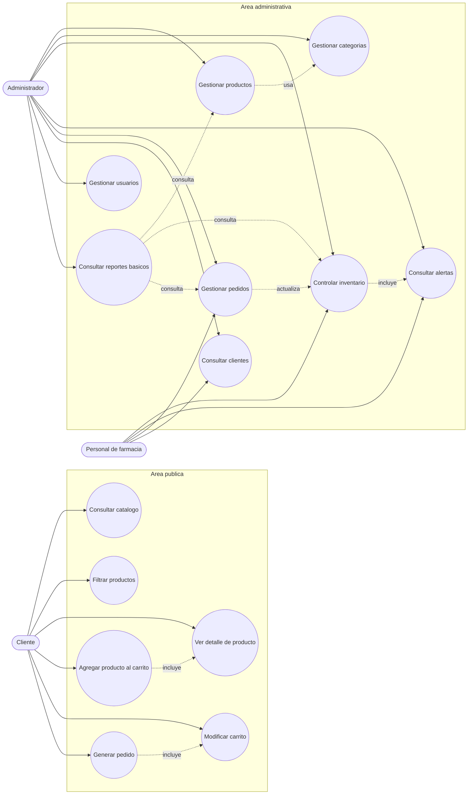

# Diagrama de casos de uso

## Sistema web FarmaGest Vital

## 1. Objetivo del diagrama

Representar las principales funciones que pueden realizar los usuarios dentro de FarmaGest Vital. El diagrama se enfoca en el alcance real de la primera version: catalogo, carrito, pedidos, productos, categorias, inventario, clientes, usuarios y reportes basicos.

No se incluyen casos de uso de proveedores, compras a proveedores, detalle de compras, abastecimiento ni gestion contable.

## 2. Actores del sistema

| Actor | Descripcion |
| --- | --- |
| Cliente | Usuario externo que consulta productos, revisa detalles, agrega articulos al carrito y genera pedidos. |
| Administrador | Usuario interno encargado de gestionar productos, categorias, inventario, pedidos, usuarios y reportes. |
| Personal de farmacia | Usuario interno que apoya la atencion de pedidos, consulta inventario y registra ajustes operativos. |

## 3. Diagrama de casos de uso

## 4. Casos de uso del cliente

| Codigo | Caso de uso | Descripcion |
| --- | --- | --- |
| CU01 | Consultar catalogo | Permite al cliente visualizar productos disponibles. |
| CU02 | Filtrar productos | Permite reducir el listado segun categoria o busqueda. |
| CU03 | Ver detalle de producto | Permite revisar precio, presentacion, descripcion y disponibilidad. |
| CU04 | Agregar producto al carrito | Permite seleccionar un producto disponible y agregarlo al carrito. |
| CU05 | Modificar carrito | Permite cambiar cantidades o eliminar productos antes de confirmar. |
| CU06 | Generar pedido | Permite registrar una solicitud para atencion de la farmacia. |

## 5. Casos de uso administrativos

| Codigo | Caso de uso | Descripcion |
| --- | --- | --- |
| CU07 | Gestionar productos | Permite registrar, editar, consultar o desactivar productos del catalogo. |
| CU08 | Gestionar categorias | Permite crear y organizar categorias de productos. |
| CU09 | Controlar inventario | Permite revisar existencias y registrar ajustes basicos. |
| CU10 | Consultar alertas | Permite identificar bajo stock y productos proximos a vencer. |
| CU11 | Gestionar pedidos | Permite revisar pedidos generados por clientes y actualizar su estado. |
| CU12 | Consultar clientes | Permite revisar datos basicos asociados a pedidos. |
| CU13 | Gestionar usuarios | Permite administrar usuarios internos y roles basicos. |
| CU14 | Consultar reportes basicos | Permite visualizar informacion resumida sobre productos, pedidos e inventario. |

## 6. Relaciones importantes

| Relacion | Descripcion |
| --- | --- |
| Agregar producto al carrito incluye ver detalle | El cliente normalmente revisa la informacion antes de agregar un producto. |
| Generar pedido incluye modificar carrito | Antes de confirmar, el cliente puede revisar cantidades y productos. |
| Gestionar productos usa categorias | Cada producto debe pertenecer a una categoria. |
| Controlar inventario incluye consultar alertas | Las alertas dependen del stock y vencimientos registrados. |
| Gestionar pedidos actualiza inventario | Al completar un pedido, el stock debe descontarse. |
| Reportes consultan informacion operativa | Los reportes usan datos de productos, pedidos e inventario. |

## 7. Resultado esperado

El diagrama permite visualizar con claridad quienes interactuan con el sistema y que funciones pertenecen a la primera version. Esto ayuda a mantener el desarrollo enfocado y evita agregar modulos que no son necesarios para cumplir el objetivo del proyecto.
