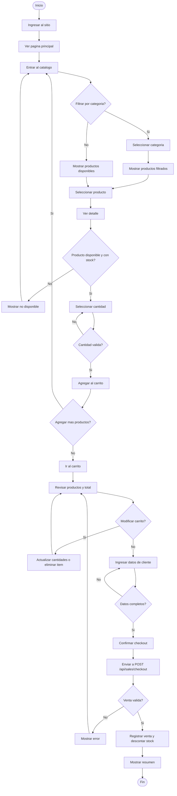

# Diagrama De Flujo Del Cliente

## FarmaGest Vital

## 1. Objetivo

Representar el recorrido del cliente desde el catalogo hasta el checkout publico. El cliente no crea cuenta ni inicia sesion; sus datos se capturan al finalizar la compra.

## 2. Diagrama

## 3. Descripcion

| Paso | Accion | Resultado |
| --- | --- | --- |
| 1 | Cliente entra al sitio. | Se muestra inicio y catalogo. |
| 2 | Consulta productos. | Ve productos disponibles. |
| 3 | Revisa detalle. | Confirma precio, presentacion y disponibilidad. |
| 4 | Agrega productos al carrito. | El carrito visual se actualiza. |
| 5 | Revisa carrito. | Puede ajustar cantidades o eliminar productos. |
| 6 | Ingresa datos. | Nombre, telefono, correo y direccion opcional. |
| 7 | Confirma compra. | El frontend envia checkout al backend. |
| 8 | Backend valida venta. | Crea o reutiliza cliente, valida stock y vencimiento. |
| 9 | Backend registra venta. | Crea `orders`, `order_items` y descuenta stock. |

## 4. Validaciones

| Validacion | Descripcion |
| --- | --- |
| Datos de cliente | Nombre, telefono y correo son obligatorios. |
| Producto activo | El producto debe estar activo y disponible. |
| Producto no vencido | No se vende un producto con fecha vencida. |
| Stock suficiente | La cantidad solicitada no puede superar el stock. |
| Venta atomica | Si falla un item, se revierte toda la operacion. |

## 5. Resultado Esperado

El cliente completa una compra sin registrarse. El sistema guarda o reutiliza sus datos por email, registra la venta y actualiza stock.
