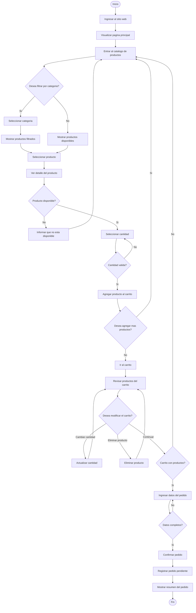

# Diagrama de flujo del cliente

## Sistema web FarmaGest Vital

## 1. Objetivo del diagrama

Representar el recorrido principal que realiza un cliente dentro del sistema web, desde el ingreso al catalogo hasta la generacion del pedido. El diagrama muestra las acciones del usuario, las validaciones basicas del sistema y los posibles retornos al catalogo o al carrito.

## 2. Diagrama de flujo

## 3. Descripcion del flujo

| Paso | Accion | Resultado |
| --- | --- | --- |
| 1 | El cliente ingresa al sitio web. | Se muestra la pagina principal. |
| 2 | El cliente entra al catalogo. | Se muestran productos disponibles o destacados. |
| 3 | El cliente filtra por categoria, si lo desea. | Se actualiza el listado de productos. |
| 4 | El cliente selecciona un producto. | Se muestra el detalle del producto. |
| 5 | El sistema valida disponibilidad. | Si el producto no esta disponible, el cliente vuelve al catalogo. |
| 6 | El cliente selecciona cantidad. | El sistema valida que no supere el stock. |
| 7 | El cliente agrega el producto al carrito. | El carrito se actualiza. |
| 8 | El cliente decide si agrega mas productos. | Puede volver al catalogo o pasar al carrito. |
| 9 | El cliente revisa el carrito. | Puede modificar cantidades, eliminar productos o continuar. |
| 10 | El cliente ingresa sus datos. | El sistema valida que la informacion este completa. |
| 11 | El cliente confirma el pedido. | El sistema registra el pedido con estado pendiente. |
| 12 | El sistema muestra el resumen. | El cliente visualiza el numero o resumen del pedido. |

## 4. Validaciones principales

| Validacion | Descripcion |
| --- | --- |
| Producto disponible | El producto debe tener stock y estar activo. |
| Cantidad valida | La cantidad solicitada no debe superar el stock disponible. |
| Carrito con productos | No se puede confirmar un pedido si el carrito esta vacio. |
| Datos completos | El cliente debe ingresar la informacion requerida para generar el pedido. |
| Pedido pendiente | Todo pedido confirmado queda registrado inicialmente como pendiente. |

## 5. Resultado esperado

El cliente puede consultar productos, revisar detalles, agregar articulos al carrito, modificar su seleccion y generar un pedido. Al finalizar, el pedido queda registrado con estado pendiente para que sea revisado por la farmacia.
